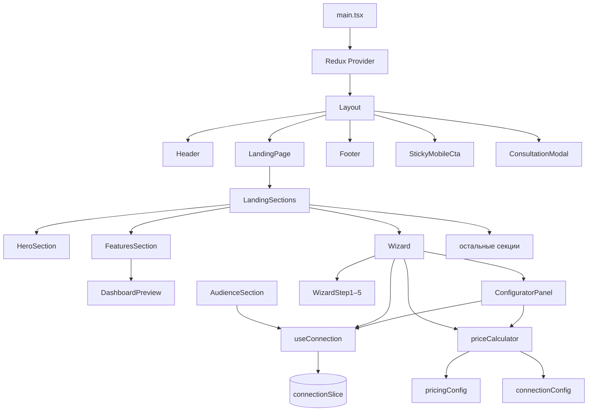

# Цифровой гражданин — frontend

Лендинг платформы НАФИ для оценки цифровых компетенций с конфигуратором подключения, 5-шаговым визардом оформления и встроенным preview панели управления.

## Содержание

- [Стек](#стек)
- [Быстрый старт](#быстрый-старт)
- [Архитектура](#архитектура)
- [Пользовательские сценарии](#пользовательские-сценарии)
- [Секции лендинга](#секции-лендинга)
- [Демо-панель управления](#демо-панель-управления)
- [Визард подключения](#визард-подключения)
- [Расчёт стоимости](#расчёт-стоимости)
- [Redux-состояние](#redux-состояние)
- [Что реализовано, а что mock](#что-реализовано-а-что-mock)
- [Структура проекта](#структура-проекта)
- [Контент и конфигурация](#контент-и-конфигурация)
- [Стили и UI](#стили-и-ui)
- [Интеграция с backend](#интеграция-с-backend)
- [Импорты (path aliases)](#импорты-path-aliases)

## Стек

| Технология | Назначение |
|------------|------------|
| **React 19** + **TypeScript** | UI и типизация |
| **Vite 8** | Сборка и dev-сервер |
| **Redux Toolkit** | Глобальное состояние конфигуратора и визарда |
| **SCSS Modules** | Изолированные стили компонентов |

Роутер не используется: одна страница — лендинг.

## Быстрый старт

```bash
cd client
npm install
npm run dev
```

Приложение откроется на `http://localhost:5173`.

### Команды

| Команда | Описание |
|---------|----------|
| `npm run dev` | Dev-сервер с HMR |
| `npm run build` | TypeScript-проверка + production-сборка в `dist/` |
| `npm run preview` | Локальный просмотр production-сборки |
| `npm run lint` | ESLint |

## Архитектура

Точка входа — `src/main.tsx`: Redux Provider оборачивает `Layout`. `Layout` рендерит лендинг.



### Потоки данных

1. **Конфигуратор** — параметры (`count`, `audience`, `options`) в Redux; используются в визарде, секции «Для кого» и расчёте цены.
2. **Визард** — форма, способ оплаты, тип плательщика (на шаге оплаты) и шаг — в том же slice; ошибки валидации — локальный `useState` в `Wizard`.
3. **Консультация и контакты** — локальный state в `ConsultationModal` и `ContactsSection`, не связаны с Redux.
4. **Демо-панель** — локальный UI-state внутри `FeaturesSection` (вкладки, раскрытие компетенций), без Redux.

## Пользовательские сценарии

### Подключение через визард

1. Пользователь настраивает параметры и смотрит стоимость (шаг 1) или переходит из секции «Для кого» к `#wizard`.
2. Заполняет контактные данные (шаг 2) — валидация на «Далее» (имя, фамилия, email, телефон, компания ≥ 3 символа, согласие на ПДн).
3. Принимает mock-договор (шаг 3).
4. Выбирает тип плательщика и способ оплаты, нажимает «Оплатить» (шаг 4).
5. Экран успеха (шаг 5); сброс — `resetWizard()`. Повторный `openWizard()` после успеха тоже сбрасывает визард на шаг 1.

### Секция «Для кого»

При смене вкладки вызывается `setAudienceWithRecommendations()` — меняется активный сегмент ЦА (опции конфигуратора при этом не переключаются автоматически). Чекбоксы рекомендуемых опций синхронизированы с конфигуратором.

### Консультация

Кнопки «Получить консультацию» (шапка, hero, визард, FAQ, CTA-баннер, «Для кого») открывают `ConsultationModal`. Поля: имя, фамилия, email, телефон, согласие. Отправка — имитация с задержкой 800 ms.

## Секции лендинга

Порядок рендера — `LandingSections.tsx`:

| # | Компонент | Якорь | Описание |
|---|-----------|-------|----------|
| 1 | `HeroSection` | — | Заголовок, сценарии, CTA, мини-конфигуратор |
| 2 | `TrustSection` | — | Слайдер логотипов, статистика |
| 3 | `BenefitsSection` | `#benefits` | Преимущества продукта |
| 4 | `StepsSection` | `#steps` | Этапы подключения (стрелки между шагами на desktop) |
| 5 | `Wizard` | `#wizard` | Конфигуратор + 5-шаговый визард |
| 6 | `WhyNafiSection` | — | Почему НАФИ |
| 7 | `AudienceSection` | — | Сегменты ЦА, рекомендуемые опции |
| 8 | `FeaturesSection` | — | Функционал + встроенный preview панели (`DashboardPreview`) |
| 9 | `CompetenciesSection` | — | 5 компетенций DigComp, flip-карточки, демо-вопросы |
| 10 | `CasesSection` | `#cases` | Кейсы |
| 11 | `FaqSection` | `#faq` | Частые вопросы + ссылка на консультацию |
| 12 | `CtaBannerSection` | — | Промо-баннер с CTA |
| 13 | `ContactsSection` | `#contacts` | Контактная форма (mock) |

Навигация в шапке — `NAV_LINKS` в `landingData.ts`. Скролл к якорям — `scrollToSection` (с учётом sticky-хедера).

## Демо-панель управления

Компонент `DashboardPreview` встроен в `FeaturesSection` — ознакомительный UI с демо-данными.

| Вкладка | Содержание |
|---------|------------|
| Отчёт по компании | Индекс, полосы компетенций, раскрытие деталей |
| Отчёт по сотруднику | Радар (среднее по компании + сотрудник), легенда |
| Чему учить | Раскрывающиеся плашки: тема → ошибки / % / рекомендация |

## Визард подключения

| Шаг | Компонент | Содержание |
|-----|-----------|------------|
| 1 | `WizardStep1` | Параметры + стоимость (`ConfiguratorPanel` с ценами у опций + детализация открыта по умолчанию) |
| 2 | `WizardStep2` | Контактные данные (`PhoneInput`) |
| 3 | `WizardStep3` | Mock-текст лицензионного договора + чекбокс принятия |
| 4 | `WizardStep4` | Тип плательщика + способ оплаты (карта / счёт) + mock-форма карты |
| 5 | `WizardStep5` | Экран «Готово» + сброс визарда |

Названия шагов — `WIZARD_STEPS` в `landingData.ts`.

### Валидация при переходе между шагами

- **Шаг 2 → 3:** `validateConnectionForm()` — имя, фамилия, email, телефон (СНГ), компания (обязательна, мин. 3 символа), согласие на ПДн.
- **Шаг 3 → 4:** обязателен `contractAccepted`.
- **Шаг 4 → 5:** mock-оплата без реальной проверки карты.

В модалке консультации компания не обязательна (`requireCompany: false`).

## Расчёт стоимости

Логика в `src/helpers/priceCalculator.ts`:

```
licenseTotal   = count × pricePerUser
optionsTotal   = сумма фиксированных надбавок за включённые опции
subtotalExVat  = licenseTotal + optionsTotal
vatAmount      = round(subtotalExVat × VAT_RATE)   // 5%
total          = subtotalExVat + vatAmount
```

Итого в UI показывается **с НДС**.

### Тариф за пользователя

Файл `src/config/pricingConfig.ts` — ступени `USER_PRICE_TIERS` (без НДС):

| Диапазон | Цена за пользователя |
|----------|---------------------|
| до 500 чел. | 390 ₽ |
| 501–4000 чел. | 370 ₽ |
| более 4000 чел. | 340 ₽ |

Источник: [презентация НАФИ](https://nafi.ru/upload/presentations/Digiyal_Citizen.pdf).

`VAT_RATE = 0.05`.

### Дополнительные опции

Файл `src/config/connectionConfig.ts` — `CONNECTION_OPTIONS` (фиксированные надбавки, **упрощённый прототип**, не официальный прайс):

| Ключ | Название | Цена |
|------|----------|------|
| `certificates` | Сертификаты о прохождении теста | 15 000 ₽ |
| `hints` | Подсказки после неверных ответов | 8 000 ₽ |
| `recommendations` | Рекомендации по развитию | 12 000 ₽ |
| `api` | Интеграция по API | 25 000 ₽ |

Лимиты количества: `MIN_USER_COUNT = 3`, `MAX_USER_COUNT = 100 000`. Пресеты: 50 / 100 / 500 / 1000.

## Redux-состояние

Slice `connection` (`src/redux/slices/connectionSlice.ts`):

| Поле | Тип | Описание |
|------|-----|----------|
| `config.count` | `number` | Количество тестируемых |
| `config.audience` | `AudienceType` | Тип организации |
| `config.options` | `ConnectionOptions` | Включённые доп. опции |
| `form` | `ConnectionForm` | Данные формы визарда |
| `payerType` | `'individual' \| 'ip' \| 'legal'` | Тип плательщика |
| `paymentMethod` | `'card' \| 'invoice'` | Способ оплаты |
| `wizardStep` | `1…5` | Текущий шаг визарда |
| `contractAccepted` | `boolean` | Принятие договора |

### Основные actions

| Action | Назначение |
|--------|------------|
| `setCount` | Установить число пользователей (с clamp) |
| `setAudienceWithRecommendations` | Сменить активный сегмент ЦА (опции не меняет) |
| `toggleOption` | Переключить доп. опцию |
| `setFormField` | Обновить поле формы визарда |
| `setPayerType` | Сменить плательщика (авто-выбор способа оплаты) |
| `setWizardStep` | Перейти на шаг |
| `resetWizard` | Сбросить визард к начальному состоянию |

Хук **`useConnection()`** — единая точка доступа. `openWizard()` прокручивает к `#wizard`; если визард на «Готово», сначала вызывает `resetWizard()`.

## Что реализовано, а что mock

| Функция | Статус |
|---------|--------|
| Лендинг (секции, тексты) | Реальный UI |
| Конфигуратор (кол-во, опции с ценами в скобках) | Реальный UI + расчёт цены |
| Визард подключения (5 шагов) | Реальный UI |
| Детализация стоимости | Открыта по умолчанию |
| Расчёт стоимости | По тарифам НАФИ + НДС 5% |
| Надбавки за опции | Упрощённый прототип |
| Демо-панель в Features | Реальный UI, демо-данные |
| Лицензионный договор | Mock-текст |
| Оплата картой | Mock-форма |
| Отправка форм (консультация, контакты) | Mock (задержка 800 ms) |
| Backend / API | Отсутствует |

## Структура проекта

```
client/
├── public/                      # favicon, логотипы, стрелки, hero-bg.mp4
├── src/
│   ├── assets/
│   │   ├── competencies/        # Иконки сфер компетенций
│   │   └── global.css           # CSS-переменные, reset
│   ├── components/
│   │   ├── configurator/        # ConfiguratorPanel
│   │   ├── footer/
│   │   ├── header/
│   │   ├── modal/               # ConsultationModal, SampleTestModal
│   │   ├── stickyBar/           # StickyMobileCta
│   │   ├── ui/                  # Button, SectionTitle, PhoneInput
│   │   └── wizard/
│   │       ├── steps/           # WizardStep1 … WizardStep5
│   │       └── Wizard.tsx
│   ├── config/
│   │   ├── connectionConfig.ts  # Сегменты ЦА, опции, дефолты, лимиты
│   │   └── pricingConfig.ts     # Тарифные ступени, VAT_RATE
│   ├── data/
│   │   └── landingData.ts       # Тексты и контент лендинга
│   ├── helpers/
│   │   ├── phoneFormat.ts       # Форматирование телефонов СНГ
│   │   ├── priceCalculator.ts
│   │   ├── scrollToSection.ts
│   │   ├── typograph.ts         # Неразрывные пробелы после коротких слов
│   │   └── validateForm.ts
│   ├── layout/                  # Layout (Header + main + Footer)
│   ├── pages/
│   │   ├── dashboardPreview/    # DashboardPreview (в FeaturesSection)
│   │   └── landingPage/
│   │       ├── sections/
│   │       ├── LandingPage.tsx
│   │       └── LandingSections.tsx
│   ├── redux/
│   │   ├── hooks/useConnection.ts
│   │   ├── slices/connectionSlice.ts
│   │   └── store.ts
│   ├── types.ts
│   └── main.tsx
├── index.html
├── vite.config.ts
└── tsconfig.app.json
```

## Контент и конфигурация

### Тексты лендинга

Файл **`src/data/landingData.ts`**:

| Константа | Назначение |
|-----------|------------|
| `NAV_LINKS` | Навигация в шапке |
| `HERO_BADGES`, `HERO_SCENARIOS` | Блок hero |
| `TRUST_LOGOS`, `TRUST_STATS` | Блок доверия |
| `BENEFITS`, `FAQ_ITEMS`, `CASES` | Секции |
| `PLATFORM_FEATURES` | Карточки блока возможностей |
| `COMPETENCIES` | 5 сфер компетенций (иконка, skills, report) |
| `DEMO_QUESTIONS` | Примеры вопросов в `SampleTestModal` |
| `AUDIENCE_TABS` | Вкладки «Для кого» (боли, выгоды, кейсы) |
| `WIZARD_STEPS` | Названия шагов визарда |
| `BASE_FEATURES` | Базовый функционал в конфигураторе |

Разметка секций — в `src/pages/landingPage/sections/`.

### Типы организаций

Источник сегментов — `AUDIENCE_SEGMENTS` в `connectionConfig.ts`.

| Производная | Назначение |
|-------------|------------|
| `AUDIENCE_TABS` | Вкладки секции «Для кого» (из сегментов + тексты) |

Тип организации в hero и конфигураторах не выбирается — только количество тестируемых и доп. опции (все выключены по умолчанию). В конфигураторе рядом с названием опции показывается цена в скобках (серым); в сайдбаре визарда — только названия.

### Дефолты

`connectionConfig.ts`:

- `DEFAULT_CONNECTION_FORM` — пустая форма (`firstName`, `lastName`, `email`, `company`, `phone`, `comment`, `consent`)
- `DEFAULT_CONNECTION_CONFIG` — кол-во 100, аудитория `medium`, все доп. опции выключены
- `DEFAULT_PAYER_TYPE` / `DEFAULT_PAYMENT_METHOD` — юрлицо + счёт

## Стили и UI

- Глобальные CSS-переменные и reset — `src/assets/global.css`
- Компонентные стили — SCSS Modules (`*.module.scss`)
- Общий контейнер — класс `.container` (max-width: 1100px)
- Секции — класс `.section`, альтернативный фон — `.section--alt`

### Дизайн-токены

| Переменная | Значение | Назначение |
|------------|----------|------------|
| `--color-primary` | `#ffc41e` | Акцент НАФИ |
| `--color-text` | `#2b2b2b` | Основной текст |
| `--color-bg` | `#f5f5f5` | Фон страницы |
| `--container-width` | `1100px` | Ширина контента |
| `--header-height` | `72px` | Высота шапки |
| `--radius` | `8px` | Скругления |

### UI-компоненты

- **`Button`** — варианты `primary` (по умолчанию) и `secondary`
- **`SectionTitle`** — заголовок и подзаголовок секции
- **`PhoneInput`** — телефон с кодом страны (СНГ)

## Интеграция с backend

Точки, куда можно подключить реальный API:

| Место | Файл | Что отправлять |
|-------|------|----------------|
| Заявка на консультацию | `ConsultationModal.tsx` → `handleSubmit` | поля формы консультации |
| Контактная форма | `ContactsSection.tsx` → `handleSubmit` | email, comment, consent |
| Завершение визарда | `Wizard.tsx` → `nextStep` на шаге 4 | `config`, `form`, `payerType`, `paymentMethod`, `price` |
| Оплата | `WizardStep4.tsx` | Данные карты / выбор счёта |

Рекомендуемый подход:

1. Создать `src/api/` с функциями `submitConsultation`, `submitContact`, `createOrder`, `processPayment`.
2. Вынести base URL в `VITE_API_URL`.
3. Заменить `setTimeout` в формах на `fetch` / axios с обработкой ошибок.
4. Mock-текст договора в `WizardStep3` заменить на загрузку PDF или HTML с сервера.

## Импорты (path aliases)

Используйте `@/` вместо относительных путей:

```ts
import { Button } from '@/components/ui/Button'
import { useConnection } from '@/redux/hooks/useConnection'
import { DashboardPreview } from '@/pages/dashboardPreview/DashboardPreview'
```

Настроено в `vite.config.ts` и `tsconfig.app.json`.
